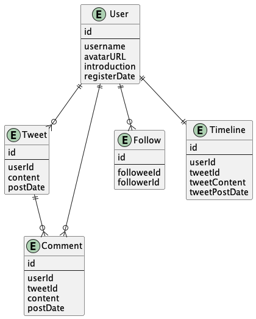
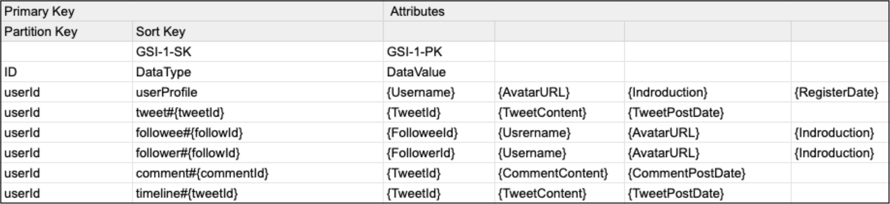

# scalable-twitter

A highly scalable API server that can withstand over 10 million users. This API server is an SNS like Twitter. The following functions are implemented.

- Post a tweet
- Post a comment on tweet
- Follow a user
- Show tweets of followees on the timeline

ER Diagram is following.



Details are written in [this article](https://dev.to/koukikitamura/server-can-handle-10-million-users-10h8).

## Requirements

- Docker

## API Server Dependencies

- Node 16.14
- Express 4.17.3
- DynamoDB 2012-08-10

## Usage

The following command starts the server and database.

```
 docker-compose up
```

## Software Design

This project is designed based on DDD(Domain Driven Development).

| Directory Name     | DDD Layer            | Components                                   |
| ------------------ | -------------------- | -------------------------------------------- |
| src/domain         | Domain Layer         | Entity / Value Object / Repository Interface |
| src/application    | Application Layer    | Application Service / Serializer             |
| src/infrastructure | Infrastructure Layer | Repository / AWS Config                      |
| src/presentation   | Presentation Layer   | API Server                                   |

## DynamoDB Design

The design of the table and index is as follows.



The use cases and query conditions are as follows.

| Entity  | UseCase                  | Parameters | Table / Index | Key Condition                                                       |
| ------- | ------------------------ | ---------- | ------------- | ------------------------------------------------------------------- |
| Tweet   | getTimelineByUserId      | { UserId } | Primary Key   | GetItem (ID=UserId AND begins_with(DataType, timeline))             |
| User    | getUserByUserName        | {Username} | GSI-1         | Query (DataValue=Username AND DataType=usserProfile)                |
| Follow  | getFolloweesByUserId     | {UserId}   | Primary key   | Query (ID=userId AND begins_with(DataType, followee)                |
| Follow  | getFollowersByUserId     | {UserId}   | Primary Key   | Query (ID=userId AND begins_with(DataType, follower)                |
| Follow  | getCountFoloweeByUserId  | {UserId}   | Primary Key   | Select COUNT / Query (ID=userId AND begins_with(DataType, followee) |
| Follow  | getcountFollowerByUsreId | {UserId}   | Primary Key   | Select COUNT / Query (ID=userId AND begins_with(DataType, follower) |
| Tweet   | getTweetsByUserId        | {UserId}   | Primary Key   | Query(ID=userId AND begins_with(DataType, tweet)                    |
| Tweet   | getTweetByTweetId        | {TweetId}  | GSI-1         | Query(DataValue=tweetId AND begins_with(DataType, tweet)            |
| Comment | getCommentsByTweetId     | {TweetId}  | GSI-1         | Query(DataValue=tweetId AND begins_with(DataType, comment)          |
